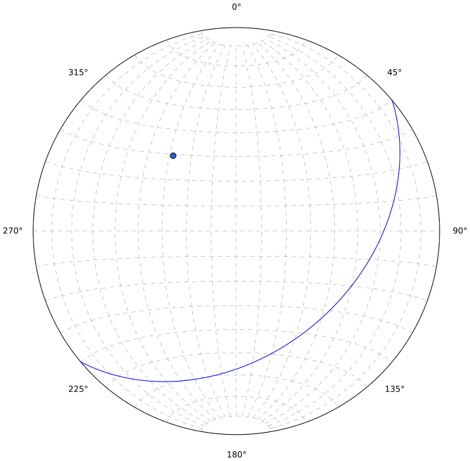

.. _datasets:

Layer types
===========

Innsbruck-Stereographic has 5 different layer types, that each have specific use cases. They are described in detail in the following sections. Each layer type has different formatting options and certain calculations are limited to one layer type.

Plane dataset
-------------

A plane dataset are used for any geologic structure that can be abstracted to a plane. In a stereonet a plane can be displayed as either a great circle or its pole.

    A plane oriented 140/40 is shown here both as a great circle and a pole.

Another important information for planes is their stratigraphic orientation. This information can be entered in the "Stratigraphy"-column, but is not required. An "n" indicates that the plane is oriented normally and an "i" indicates that the plane is oriented inversly.

Line dataset
------------

Line datasets should be chosen for structures that can be abstracted to linear elements. Lines are displayed in a stereonet as points.

Faultplane dataset
------------------

This dataset is used for faults that have a conjugated linear element, associated with the movement along this plane. In the stereonet this appears as a combination of hwo planes and linear elements are displayed.

Fold dataset
------------

The fold dataset has not been implemented yet.

Small circle dataset
--------------------

Small circle datasets are used for geologic structures that have a cone-shaped distribution in space. Small circles appear as ellipses in the stereonet.
