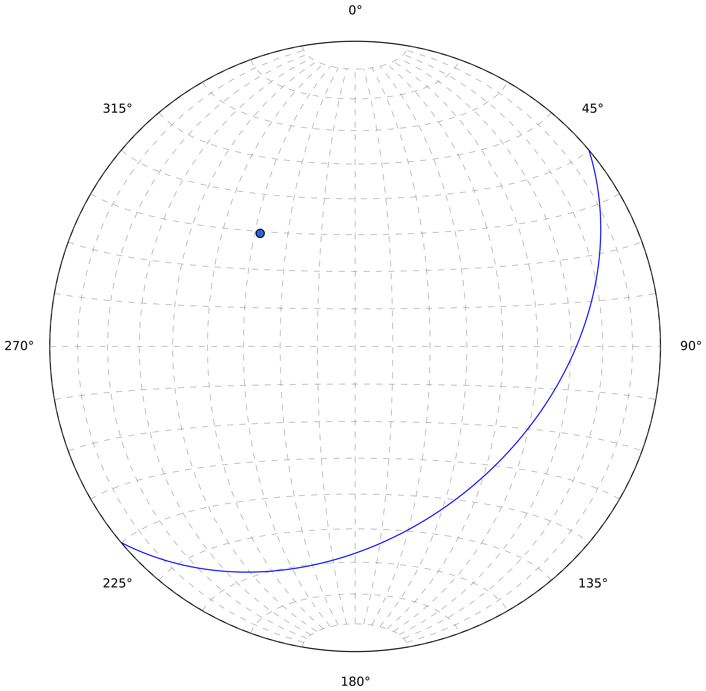

.. _datasets:

Datensätze
===========

InnStereo hat 5 verschiedene Datensätze, die jeweils bestimmte Anwendungen haben. Die Datensätze werden in den folgenden Abschnitten besprochen.

Planar-Datensätze
-----------------

Planare Datensätze werden für geologische Strukturen verwendet, die als Flächen abstrahiert werden können. Im Stereonetz lassen sich Flächen als Großkreise, oder als Polpunkte darstellen.

    Die Abbildung zeigt eine Fläche als Großkreis und Polpunkt, die 140/40 orientiert ist.

Flächendatensätze können auch die stratigraphische Orientierung speichern. Ein "n" steht für normal und ein "i" für invers. Funktionen, die die stratigraphie berücksichtigen sind noch in der Entwicklung.

Linear-Datensätze
-----------------

Lineare Datensätze werden für Strukturen verwendet, die als Linien abstrahiert werden können. Im Stereonetz erscheinen Linien als Punkte am Durchstichpunkt mit der unteren Halbkugel des Stereonetzes. 

Störungs-Datensätze
-------------------

Dieser Datensatz wird für Störungen verwendet. Jede Zeile besteht aus einer Messung der Störungsfläche (Einfallsrichtung und Einfallen), des Linears (Einfallr. und Einf.) und dem bestimmten Schersinn (Sinistral, Dextral, Aufschi
This dataset is used for faults that have a conjugated linear element, associated with the movement along this plane. In the stereonet this appears as a combination of how planes and linear elements are displayed.

Falten-Datensätze
-----------------

Falten-Datensätze sind noch in der Entwicklung.

Kleinkreis-Datensätze
---------------------

Konische Verteilungen können als Kreinkreise im Stereonetz dargestellt werden. Kleinkreise erscheinen im Stereonetz als Ellipsen. Viele lineare Strukturen zeigen aufgrund natürlicher Streuung eine Kleinkreisverteilungen.
