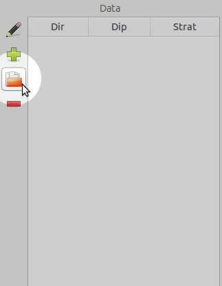
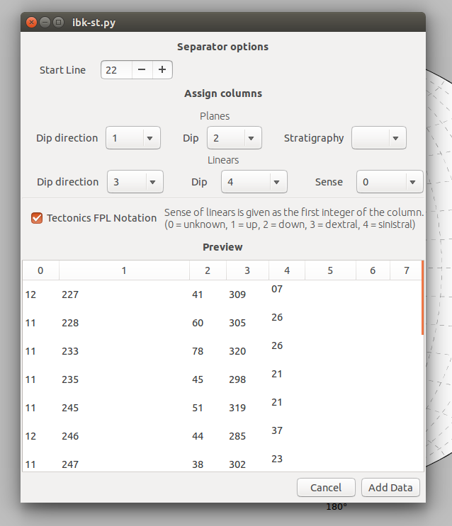
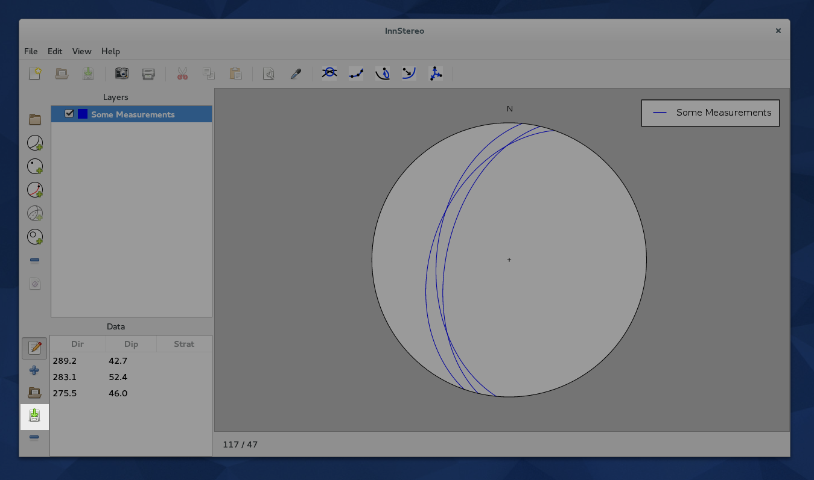

.. _dataio:

Data Input and Output
=====================

InnStereo has many ways of handling data. Project consisting of many layers can be saved and loaded as JSON files. Individual layers can be imported and exported using CSV files. InnStereo also aims to be compatible with the file formats of other stereonet programs.

Project Saving
--------------

Projects are saved using the JSON file format. The files can also be opened using any text editor. To save a project you can use the menubar or the toolbutton. The program will ask you to browse to the save location and give the file a name.

Project Loading
---------------

Projects can be loaded using the menubar or the toolbutton for opening projects. By default the file chooser will only show files with a ".json" file extension, but it can also show all file extensions. If there is already data in the window of InnStereo, the loaded data will be added to the existing data. The layers are simply appended and can then be sorted and grouped.

Data Input
----------

The easiest way to add data to an existing layer is the file parse dialog. In order to use the file parser, one needs to create a dataset first (e.g. a plane dataset) and select it. The button opens a file chooser dialog, that one can use to locate the file on the hard-drive.

    The button for the file parser is in the folder icon in the highlighted area.

After a file has been chosen the parsing dialog opens. It includes an option to skip over lines at the beginning of the file, that usually contain metadata. The result of the parsing are shown in a table at the bottom of the dialog. Using the column numbers shows in that table, one can assign the columns to their respective counterparts of InnStereo.

    The file parser dialog during a data-import. The columns in the data are assigned to the columns that InnStereo uses.

Input of legacy formats
-----------------------

The files of any program that outputs CSV-style files can be imported in InnStereo. The file formats of more prominent stereographic projection programs are listed below.

TectonicsFP
^^^^^^^^^^^

TectonicsFP (Ortner et al., 2002) and its predecessors TektonikQB, TektonikFB and TectonicVB, all use a variety of CSV files that can be easily imported using the file parser dialog. The assignment of the columns is the following:

==============  ====================================================  ===============  =============================================================================
File Extension  Despription                                           User Layer Type  Column Structure
==============  ====================================================  ===============  =============================================================================
pln             Planes                                                Plane            Dipdir, Dip, Comment
lin             Linears                                               Linear           Dipdir, Dip, Comment
fpl             Faultplanes                                           Faultplane       **(1)**, Plane Dipdir, Plane Dip, Linear Dipdir, Linear Dip, Comment
cor             Corrected Faultplanes (Linears flattened onto plane)  Faultplane       **(1)**, Plane Dipdir, Plane Dip, Linear Dipdir, Linear Dip, Comment
azi             Azimuth measurements                                  Linear           Dipdir
t**             PT-Axis calculation output                            In Development   
==============  ====================================================  ===============  =============================================================================

    This table shows how the file formats of TectonicsFP can be imported to InnStereo. **(1)** The first column of the "*.fpl" and "*.cor" files consists of a two-digit number. The first digit denotes the sense of movement of the fault ("0" or "5" = unknown, "1" or "+" = overthrust, "2" or "-" = downthrust, "3" = dextral strike-slip, "4" = sinistral strike-slip). The second digit denotes the quality or, or the confidence in the measurement. The first digit can be parsed using the "Tectonics FPL Notation" checkbox. The values will then be translated to the values that InnStereo uses. The second digit is currently not used in InnStereo (Measurements of different quality should be sorted in different layers).

Data Output
-----------

Datasets of individual layers can be exported in the CSV-format. This can be done by pressing on the button to the left of the data table. The user can then choose a directory and filename for the data. The button only works if only one layer is selected in the layer-tree.

CSV-files can be openend by many programs including spread-sheet-calculation programs. Other export methods and database connections are planned for the future.

    The button for data exporting is to the left of the data table.

Further Reading
---------------

 - Description of `JSON <https://en.wikipedia.org/wiki/JSON>`_ on Wikipedia
 - Description of `Comma-separated values <https://en.wikipedia.org/wiki/Comma-separated_values>`_ on Wikipedia
 - Ortner, H., Reiter, F. & Acs, P. (2002). *Easy handling of tectonic data: the programs TectonicVB for Mac and TectonicsFP for Windows.* Computers & Geosciences(28/10), 1193-1200 (`doi:10.1016/S0098-3004(02)00038-9 <https://doi.org/10.1016/S0098-3004%2802%2900038-9>`_).
 - Reiter, F. & Acs, P., (1996-2011). *TectonicsFP 1.75 - Computer Software for Structural Geology: Operating Manual.* Bundled with the TectonicsFP installation.
