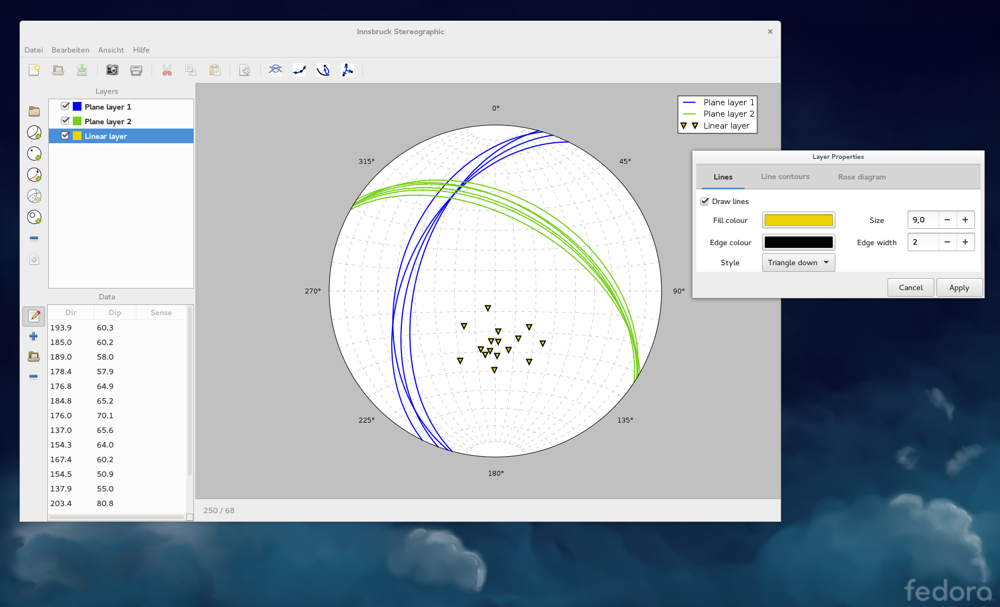
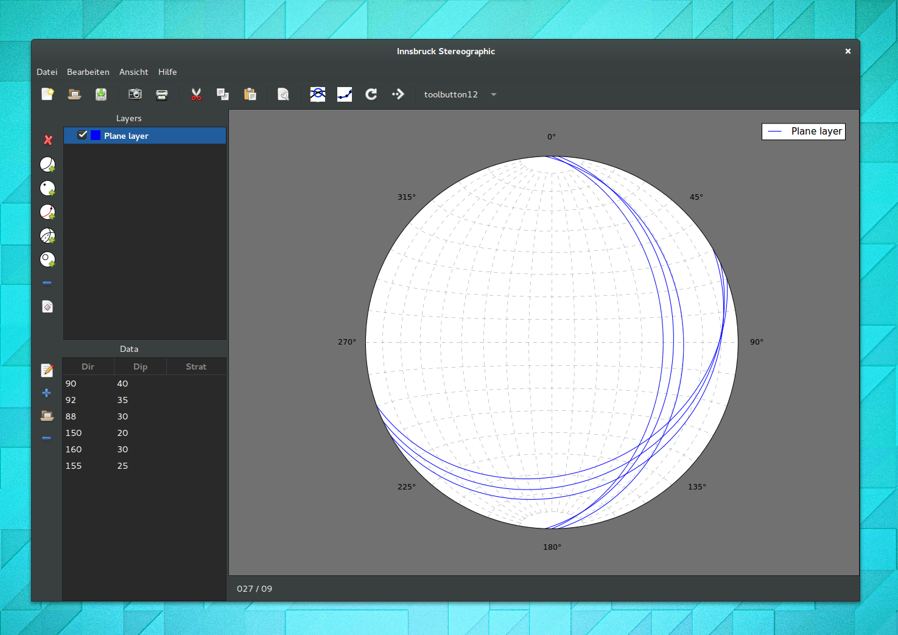
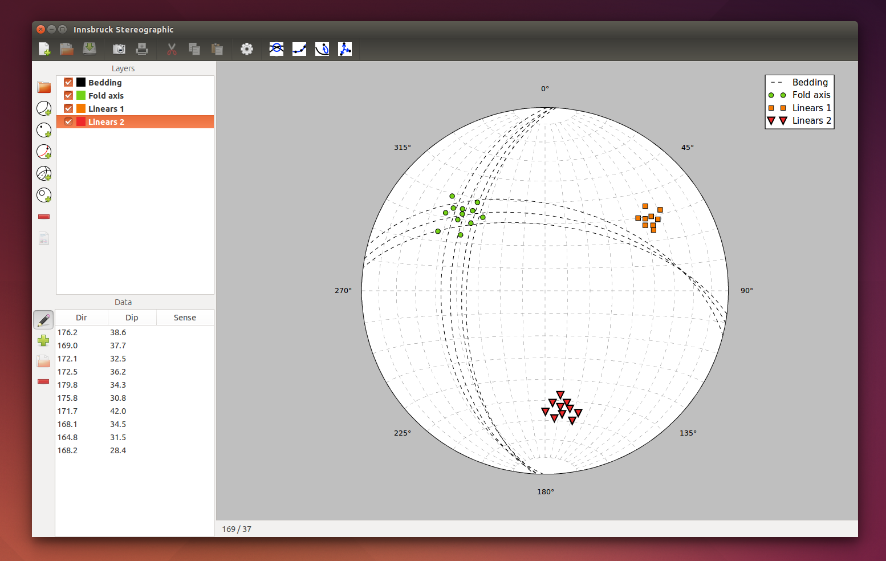

.. _screenshots:

Screenshots
===========

This is collection of screenshots how the interface looks in various distributions.

    Innsbruck Stereographic running on Fedora 21 using the Gnome 3 desktop.

    Innsbruck Stereographic running on Ubuntu-Gnome 15.04.

    Innsbruck Stereographic running on Ubuntu 14.10 using the Unity 7 desktop.

