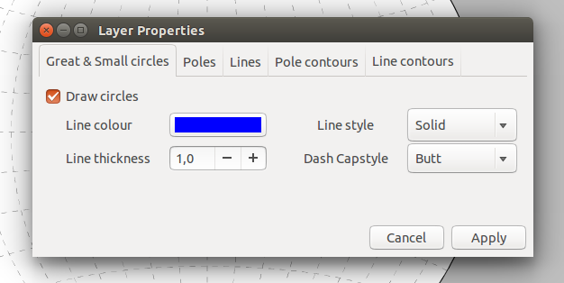

.. _formatting:

Formatting
==========

Layer formatting
----------------

Layers can be formatted by double-clicking the layer-view (In order to avoid renaming the layer it is best to double-click on the colored square).

Great circles and small circles both appear as lines in the stereonet. One can set the color, thickness, style (solid, dashed), and the capstyle for lines.

Linears appear as points in the stereonet. One can set a fill color, edge color, style (circle, square, etc..), size, and edge thickness for points.

    The layer properties dialog how it appears for a fault plane dataset.

Plot formatting
---------------

Plot formatting options are set in the plot properties dialog. Currently only the grid can be turned on and off.

Further Reading
---------------
 - The official `Inkscape homepage <https://inkscape.org>`_

