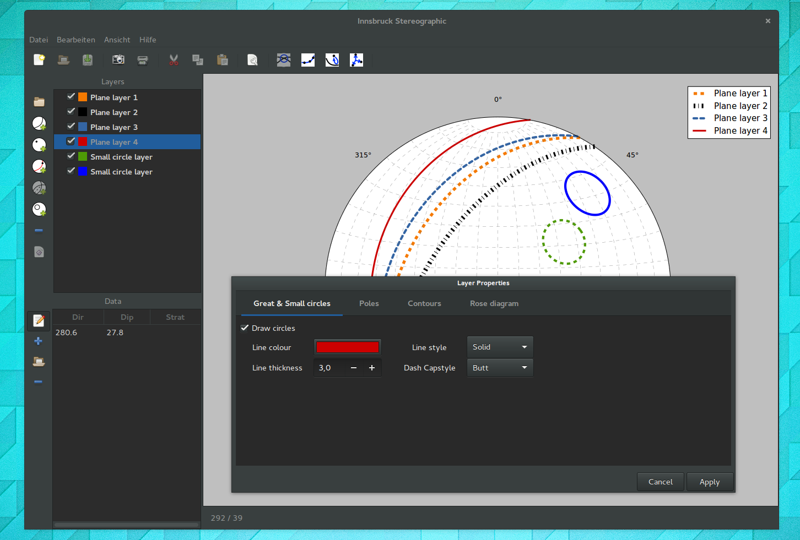
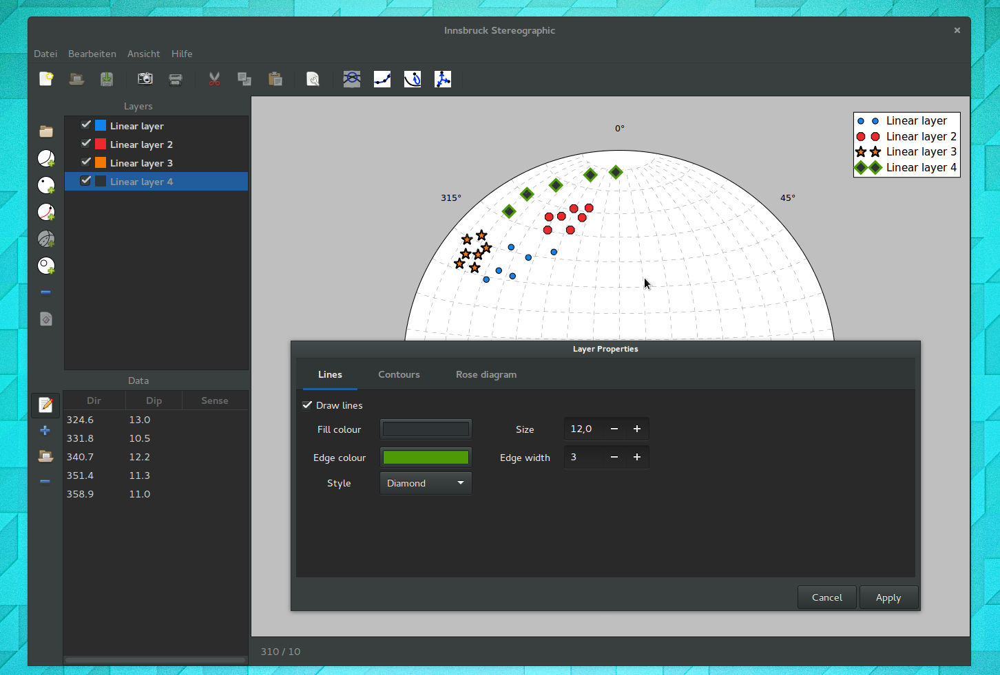
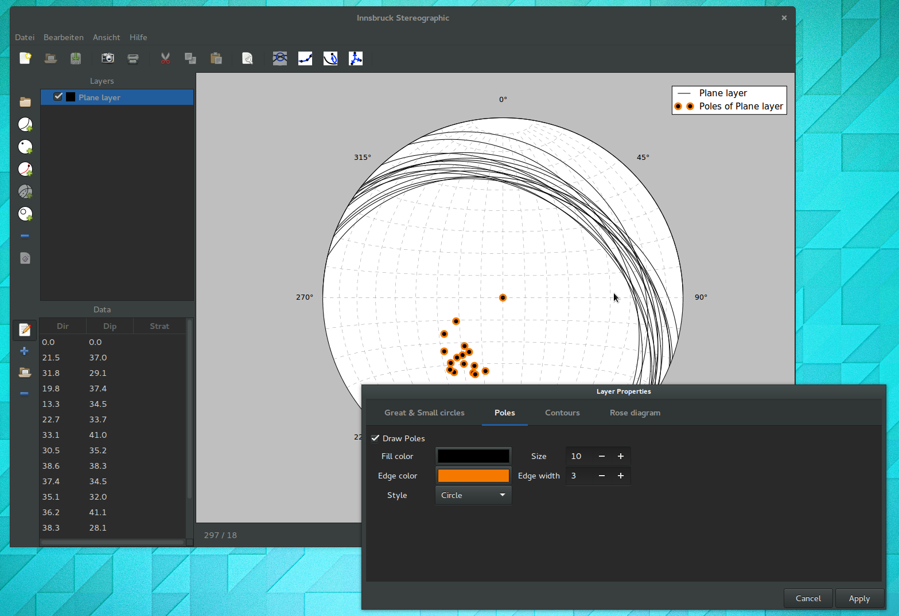
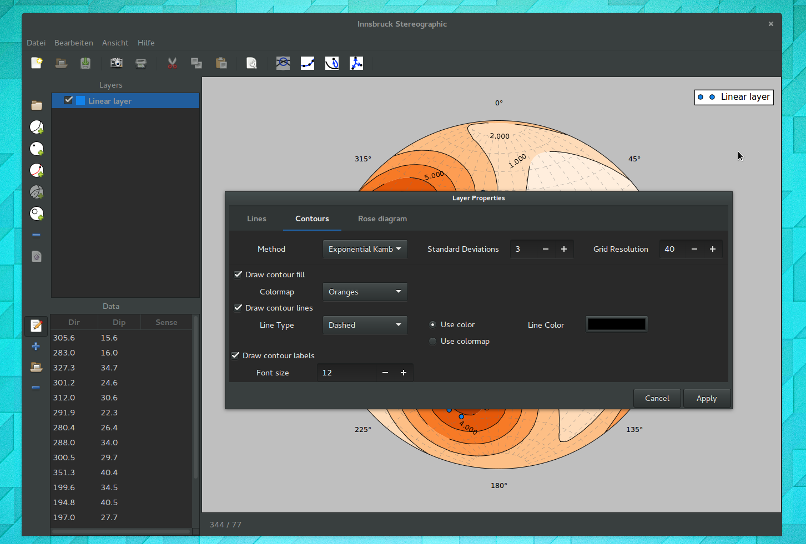
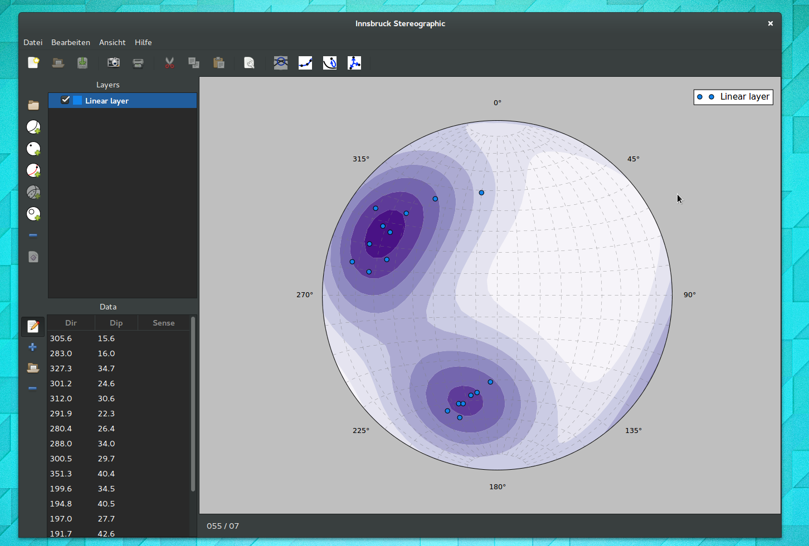
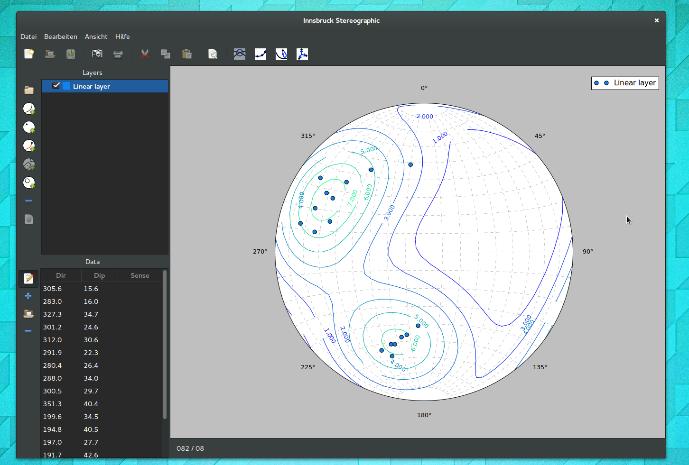
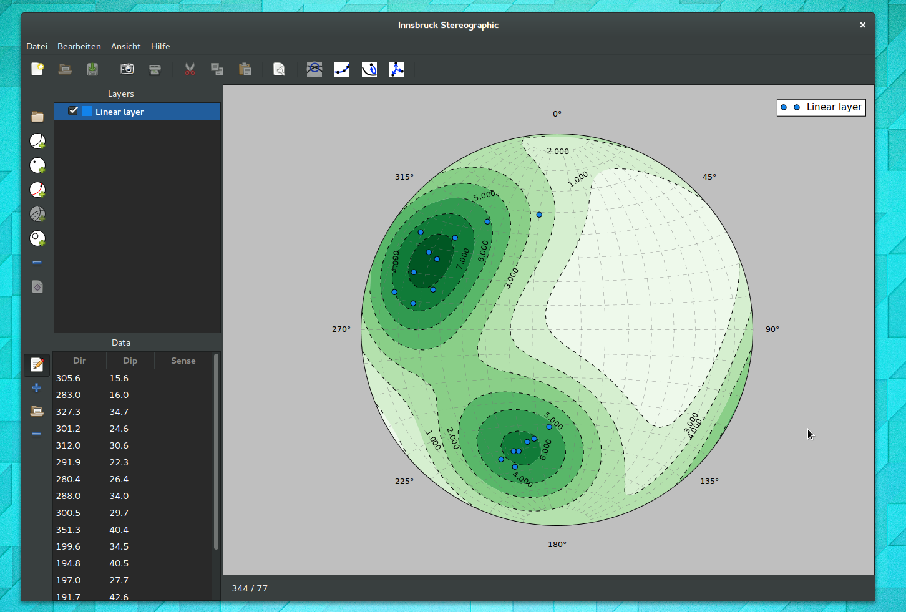

.. _formatting:

Figure Formatting
=================

Formatting is not just a way of displaying information, but a science in itself. Formatting of figures has a strong influence on how information is conveyed. If a figure is to be used in a scientific publication, extra care should be taken, in order to not be misleading. Especially the usage of certain colourmaps have recently become quite controversial (See :ref:`formatting-further-reading`).

The plots produced by Innsbruck Stereographic can be customized in many ways. There are options to customize the appearance of great circles, small circles, pole points and linear elements. Each layer can have customized colours, line-styles, point-styles. Contour plots can be customized as well, using different colourmaps, contour-lines, contour-fills and contour-line-labels.

 It should be noted that it is currently not planned to offer professional layout options. This means that most plots, will look quite professional by default, it will sometimes require some post-processing in order to make them print-ready. The easiest way to do this is to save a SVG (or other vector file format) of the plot and edit it in a vector editing program like Inkscape.

.. _layer-formatting:

Layer Formatting
----------------

Layers can be formatted by double-clicking the layer-view (In order to avoid renaming the layer it is best to double-click on the coloured square). This opens the :ref:`layer-settings-dialog` where all formatting options can be applied. All changes in layer formatting are momentarily updated in the plot-legend.

.. _circle-formatting:

Great and Small Circles
^^^^^^^^^^^^^^^^^^^^^^^

Planes are transformed to great circles and conical-distributions to small circles in the stereonet. The user can set the colour, line-thickness, line-style (solid, dashed, dotted, dash-dotted), and the capstyle for these lines.

Plane- and faultplane-datasets have the option to draw the great circles or the pole-points of the individual planes. Both can be turned on an off independently. If the pole-points are contoured it might even make sense to switch both of the options off to only display the contouring.

    This figure shows the different ways in which small- and great circles can be formatted.

.. _linear-formatting:

Linear Structures
^^^^^^^^^^^^^^^^^

Linear structures appear as points in the stereonet. Common linears are pole-points of planes, fold-axes, stretching-lineations, intersection-lineation, but also things like crystallographic orientation of mineral grains or magnetic fabric orientation (For a more detailed discussion see for example: Van Der Pluijm & Marshak 2004).

The user can set fill-colours, edge-colours, point-styles (circles, squares, etc..), size, and edge-thickness for points.

    Linear structures, or the points they become in the stereonet are shown here with different formatting.

    Pole points have the same formatting options as linear-datasets have.

.. _contour-formatting:

Contours
^^^^^^^^

Contours have formatting options for the contour-fills, contour-lines and the contour-line-labels. In addition to formatting options the dialog tab also offers different methods for how the contours should be calculated (The contouring methods and their trade-offs will be discussed in a separate section of the documentation).

    Most layers have a tab in the layer-setting dialog to contour the data. There are options for contouring method and the formatting of the contours.

    Contours can be shown as fills. The colours depend on the colourmap the user chooses.

    Contour lines can either shown with a single colour, or like here, with a colourmap.

    This figure shows contouring with both contour-fills and contour-lines turned on.

.. _rose-formatting:

Rose Diagram
^^^^^^^^^^^^^

Rose diagram formatting is still under development.

.. _plot-formatting:

Plot Formatting
---------------

Plot formatting options are set in the plot properties dialog. Currently only the grid can be turned on and off.

.. _formatting-further-reading:

Further Reading
---------------
 - Ben A. Van Der Pluijm & Stephen Marshak (2004) *Earth Structure.* 2nd Edition. ISBN: 978-0-393-92467-1
 - Overview of the `Matplotlib colourmaps <http://matplotlib.org/examples/color/colormaps_reference.html>`_
 - Jake Vanderplas (2014) `How Bad Is Your Colormap? <https://jakevdp.github.io/blog/2014/10/16/how-bad-is-your-colormap/>`_
 - Kristen M. Thyng (2014) `Perceptions of Matplotlib Colormaps <https://www.youtube.com/watch?v=rkDgBvT-giw>`_
 - Damon McDougall (2014) `How to Choose a Good Colour Map <https://www.youtube.com/watch?v=Alnc9E1RnD8>`_
 - The official `Inkscape homepage <https://inkscape.org>`_

