.. _interface:

User interface
==============

This page offers an brief introduction to the user interface of Innsbruck Stereographic. Detailed information to some of these interface elements can be found by following the links.

The logic of the main window is to give the data as much space as possible and limit the visible icons to functions that will be used in most sessions. Furthermore the icons are grouped according to their context. Layer operations are close to the layer-view and dataset operations are close to the dataset-view. The calculations that take layers as input and output a new layer are grouped at the top.

    The user interface aims to conform to the `GNOME Human Interface Guidelines <https://developer.gnome.org/hig/stable/>`_.

Canvas
------

The canvas is the central and most important part of the interface. It displays different plots and the legend. The layout of the plots depends on what view is currently selected (For details see: :ref:`views`).

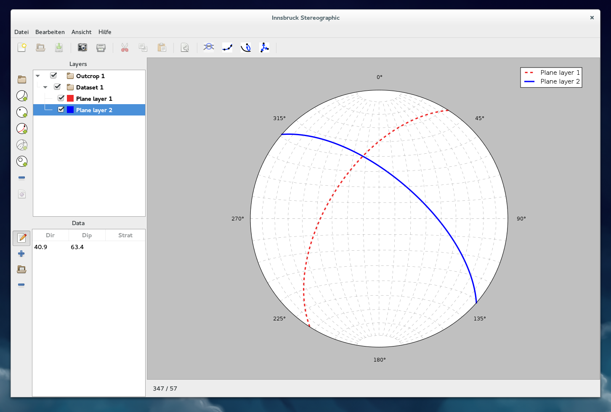

    The graphical user interface how it appears on the Gnome 3 desktop with the figure canvas in dark grey showing a single stereonet.

Menubar
-------

The menubar currently has four menus. The first offers project functions, like creating a new project. The second menu is intended for copy-paste operations but has not been implemented yet. The third menu allows the user to select different plot layouts (For details see: :ref:`views`). The last menu allows the user to access the About-Dialog.

    The menubar is still under development and might be replaced by a GTK-Headerbar as development proceeds.

.. figure:: _static/interface_menubar.png
    :width: 400px
    :align: center
    :alt: screenshot with the menubar highlighted

    The menubar as it currently appears in the development version of Innsbruck Stereographic.

.. figure:: _static/interface_menubar_views.png
    :width: 400px
    :align: center
    :alt: screenshot with the project menu for views highlighted

    The menu for views allows the user to select different plot layouts (For details see: :ref:`views`).

Project Functions
-----------------

The project functions are still under development. A new project can be created by clicking on the first button of the row. Saving and loading of projects will be implemented soon.

    The project functions allow the creation of a new project. Saving and loading projects will be implemented soon.

Printing and Image-Export
-------------------------

There are two ways to export images from Innsbruck Stereographic. A print function (not implemented yet) and an image-export dialog.

    The project functions allow the creation of a new project. Saving and loading projects will be implemented soon.

The image export dialog can save images in a number of different formats. Especially the vector formats, for example SVG, are ideal for publishing and post-processing. SVGs can be edited in programs like Inkscape to be print-ready.

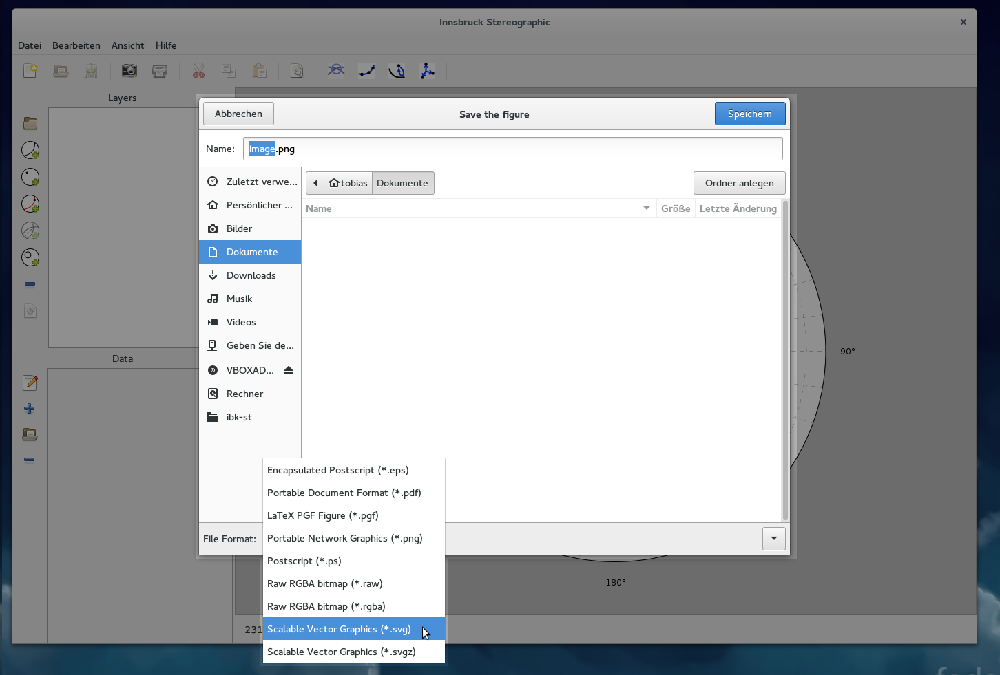

    The image export dialog offers different image formats.

Plot Settings
--------------

The plot-settings button from the top toolbar opens the plot-settings dialog.

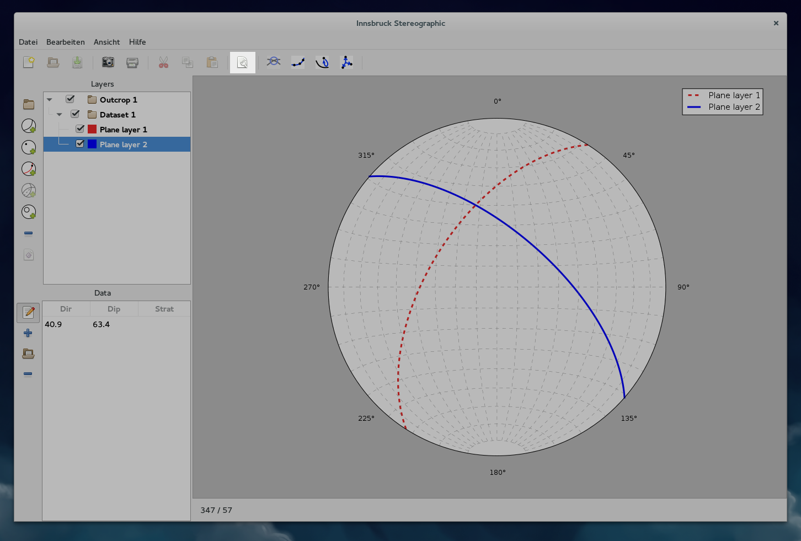

    The plot-settings button.

The dialog allows the user to change general settings of the plot. An important option is the pixel density setting. The number depends on the pixel density of the users screen and can affect the readability and the sharpness of the lines and symbols.

The next option lets the user change the projection of the stereonet. Two options are available: an equal area and an equal angle option (For details see: :ref:`stereonet`).

Below that are options to turn the grid of the stereonet on and off, and the option to turn the legend on or off.

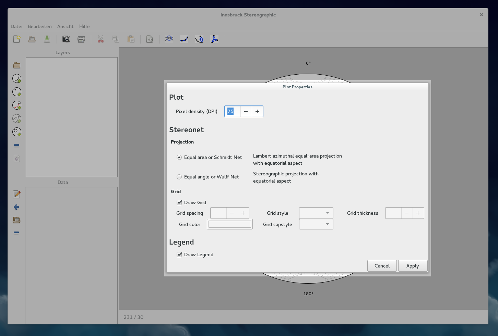

    The plot-settings dialog has option for the pixel density, the projection of the stereonet, grid settings, and legend settings.

Steronet operations
-------------------

The next group of buttons in the menubar perform stereonet operations. This part of the interface will likely still undergo many changes. Currently there are options to calculate the eigenvalue of a layer, move the poles of a layer to an independent linear dataset, and the option to find the best-fitting plane for a set of linear elements.

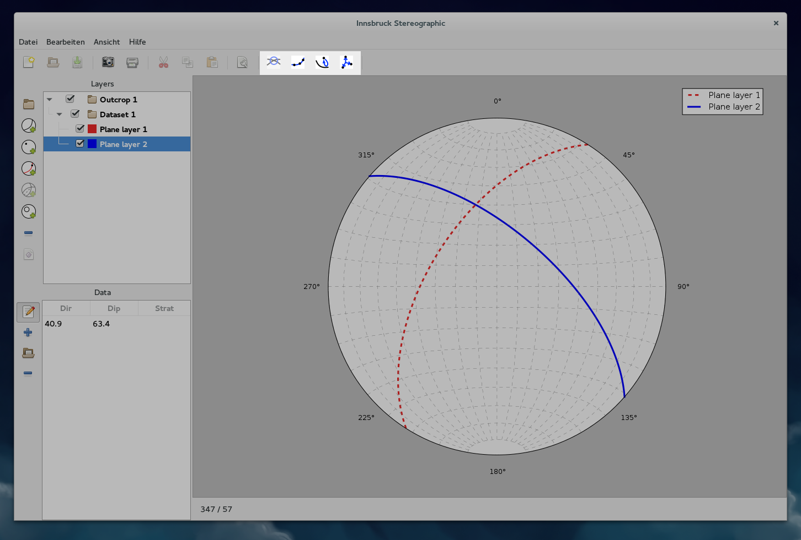

    The highlighted buttons perform stereonet operations on the selected layers. 

Layers-Section
--------------

Layer operations
^^^^^^^^^^^^^^^^

This part of the interface performs layer operations. This includes adding new data-layers, grouping layers, and deleting layers. The operations affect the layer-view which lies to the right of these buttons (See section: :ref:`layer-view`)

The 5 circular symbols, that each have a green plus symbol, create new layers, that correspond the the 5 datatypes that Innsbruck Stereographic uses. This includes layers for planes, linears, faultplanes, folds and small-circles (For details see: :ref:`datasets`).

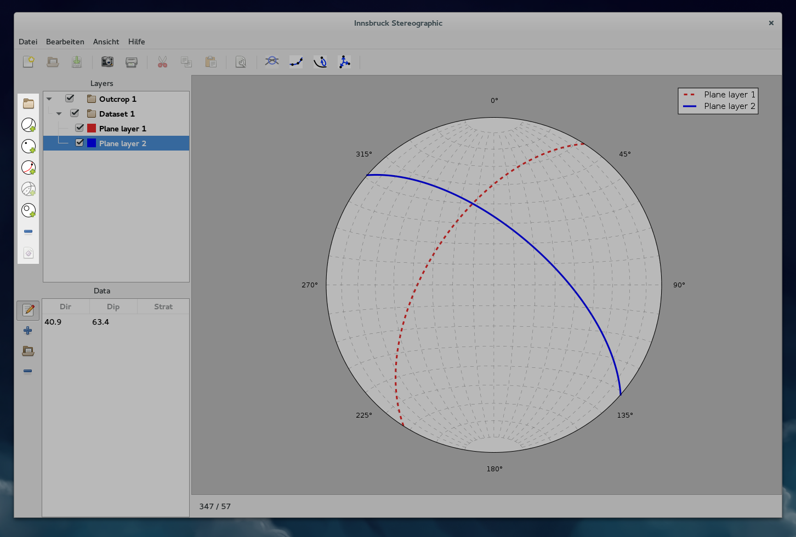

    The highlighted area shows the buttons that perform layer operations.

.. _layer-view:

Layer view
^^^^^^^^^^

The layer-view lists all the layers of a project. There are data-layers and group-layers. Group-layers are folders that can hold many data-layers. Group-layers have a folder symbol, while data-layers have a coloured box, that corresponds to either the great- or small-circle colour, or the filling of the marker for linear datasets.

The checkbox allows the toggling of each layers' visibility in the plot. A group layer that is turned off, means that all the data-layers it contains, will not be drawn either.

One or more layers can be selected for calculations, grouping, or deleting. Drag-and-drop is currently under development.

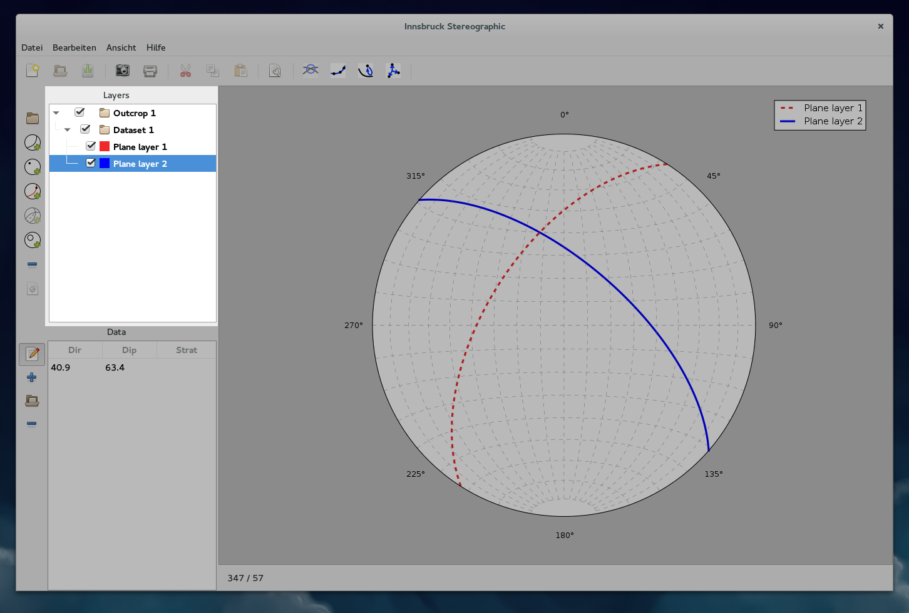

    The highlighted area shows the layer view with a few nested layers.

.. _layer_settings-dialog:

Layer-Settings Dialog
----------------------

Double clicking on a data-layer opens up the layer-settings dialog. This dialog allows each layer to be customized individually. This includes various formatting options and how the layer should be drawn. For plane-layers for example the user can customize the styling of the great circle and the pole point. The user can also choose to draw the great circle, the pole point, or both.

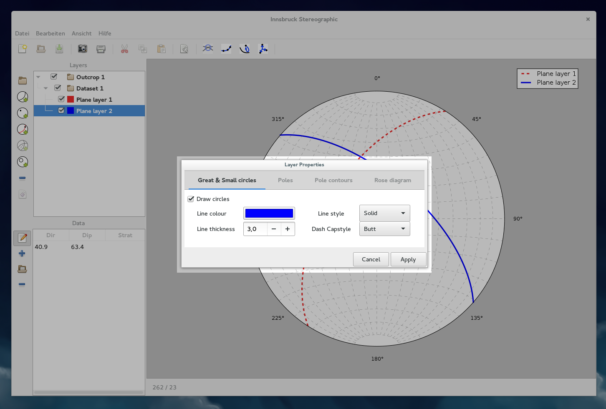

    By double clicking on a layer, the appearance can be customized in the layer-settings dialog.

Colours can be chosen for the lines, and the fill and edge of markers. This is done by clicking on the colour-buttons, which opens the colour-chooser dialog.

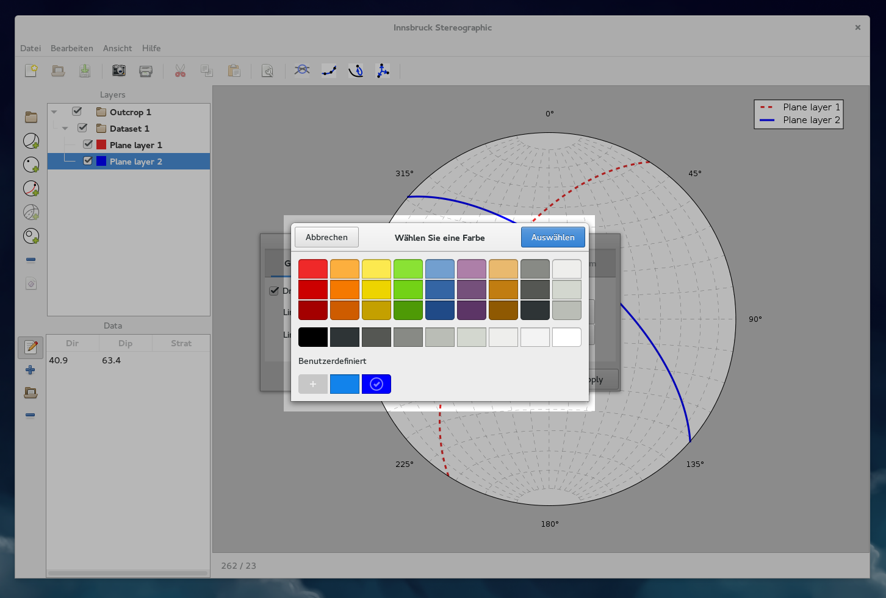

    Clicking on a colourbutton in the layer-settings dialog, open the colour-chooser dialog.

Data-Section
------------

Data Operations
^^^^^^^^^^^^^^^

The menubar for data operations stores functions that affect the data of a layer. The buttons only work when a layer is selected in the layer-view. When zero layers or more than one layer is selected, the buttons will not work.

The first button can be toggled on, to directly draw datapoints on the stereonet. There is also a button to add empty lines to the layer, to enter data in the data-view cells. The button with the folder icon opens the data-import dialog (For details see: :ref:`dataio`).

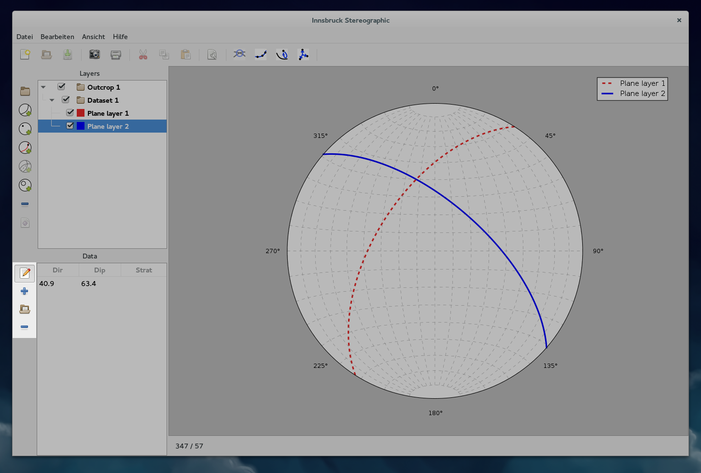

    The data operations include options to add and remove lines, import data, and draw points directly on the canvas.

Data-View
^^^^^^^^^^

The data-view displays the datapoints of the currently selected layer. If no layer or a group-layer is selected the data-view will be empty.

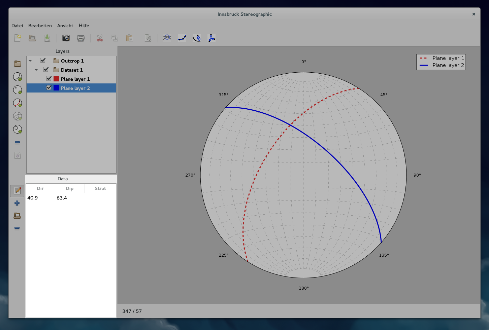

    The data-view lists all the datapoints of the currently selected layer.

Statusbar
---------

The statusbar lies below the figure canvas and is either empty or shows the dip-direction and dip of the current mouse-cursor position, when the mouse-cursor moves of the stereonet.

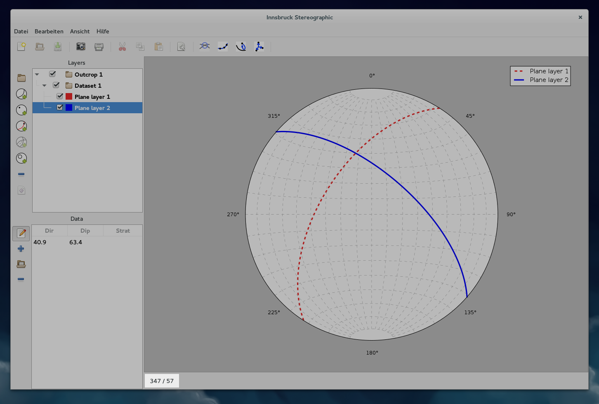

    When moving the mouse of the stereonet, the statusbar will show the dip-direction and dip of that point.

Further Reading
---------------

 - The `GNOME Human Interface Guidelines <https://developer.gnome.org/hig/stable/>`_

