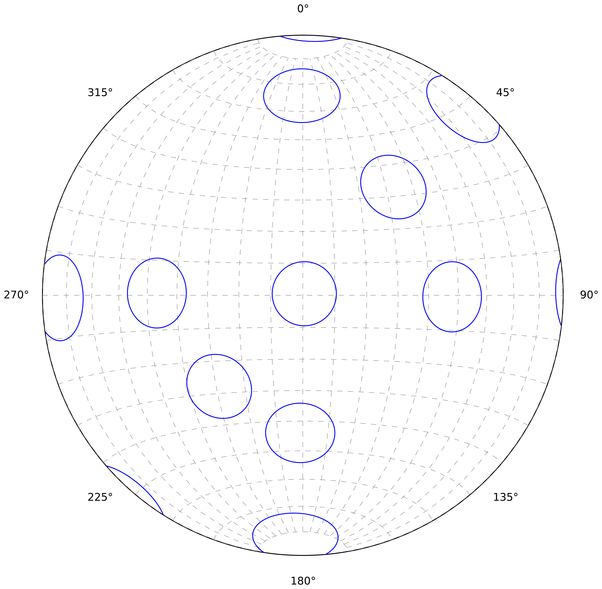
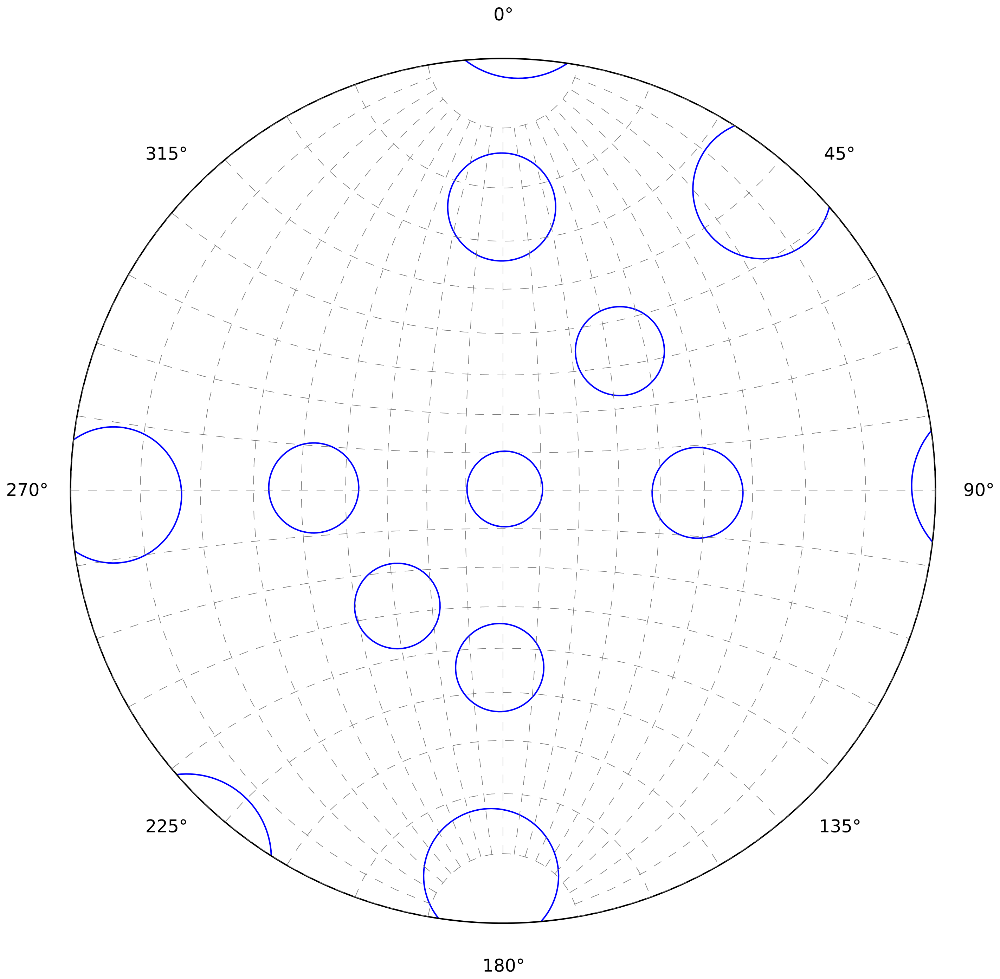

.. _stereonet:

Stereonet
=========

The *stereonet* or *stereographic projection* is the most important visualization tool for orientation data in structural geology. Most figures are made using an equal area projection, but sometimes and equal angle projection is used as well.

Projections
-----------

Equal area projection
^^^^^^^^^^^^^^^^^^^^^

In most cases it is preferable to use a projection that optimises equal area, because it makes it easier to assess the spatial distribution of structures. The projection that is usually chosen for this, is the *Lambert Azimuthal Equal-Area Projection with equatorial aspect* (See: Snyder 1987, p. 182). In geology this is usually referred to a *Schmidt Net*, after Walter Schmidt.

    Small circles (all 10° radius) make it easier to see that area is preserved reasonably well across all orientations. Angles are slightly distorted and make the circles appear as ellipses.

Equal angle projection
^^^^^^^^^^^^^^^^^^^^^^

Equal angle projection preserve angle but severely distort areas. The projection used for this kind of plots is the *Stereographic Projection with equatorial aspect* (See: Snyder 1987, p. 154). This is usually referred to as a *Wulff Net* in geology, after Georgij Viktorovich Wulff.

    Equal angle projections preserve angles, which can be seen by all small circles being perfect circles. Areas are not preserved and this is shown by the varying projected size of the small circles (all 10° radius).

Further Reading
---------------

 - John P. Snyder (1987): `Map Projections - A Working Manual <http://pubs.er.usgs.gov/publication/pp1395>`_
 - `Stereographic Projection <http://en.wikipedia.org/wiki/Stereographic_projection>`_ on Wikipedia
 - `Schmidt Net <http://en.wikipedia.org/wiki/Schmidt_net>`_ on Wikipedia
 - `Wulff Net <http://de.wikipedia.org/wiki/Wulffsches_Netz>`_ on Wikipedia
 - `Georgij Viktorovich Wulff <https://www.wikidata.org/wiki/Q907171>`_  on Wikidata 
 - `Walter Schmidt <https://www.wikidata.org/wiki/Q15979728>`_ on Wikidata

