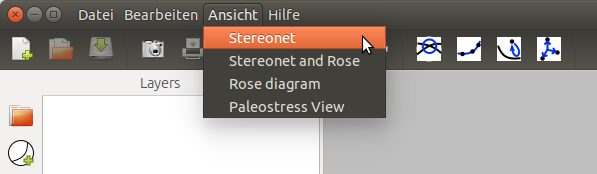
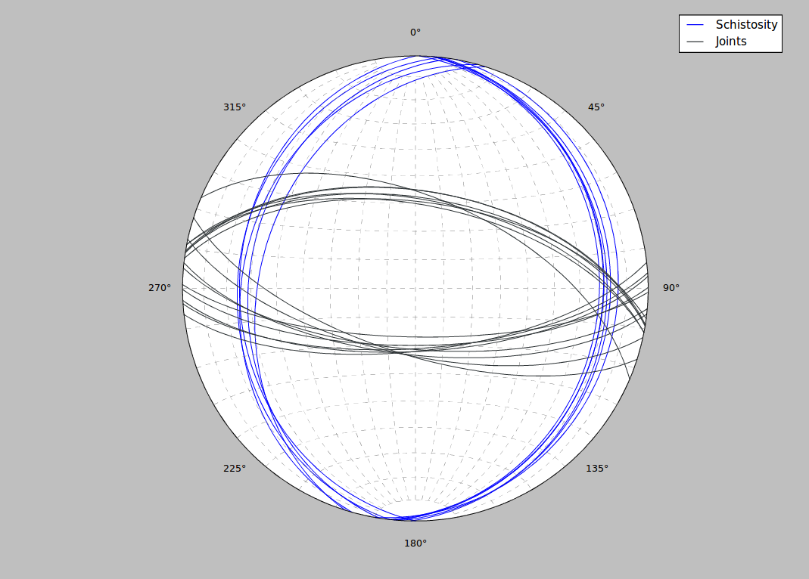
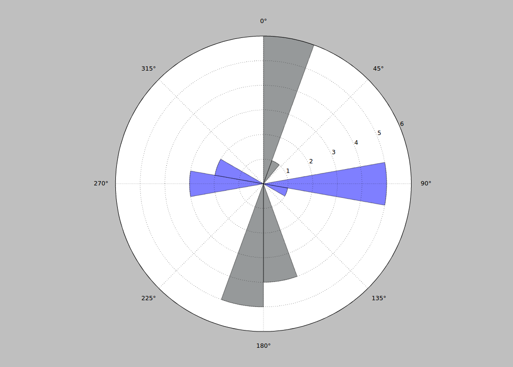

.. _views:

Views
=====

In order to get an optimal overview over a dataset, Innbruck Stereographic uses different preconfigured views that each show different aspects of the data. The views can be selected from the menubar.

    In the *Views* menu four different layouts can be selected.

Stereonet View
--------------

The stereonet view consists of only of the stereonet. It is the main view and gives the best overview over the data.

    This is how a plot appears in the stereonet view.

Stereonet and Rose-Diagram View
-------------------------------

In this view a stereonet and rose diagram are shown side-by-side. This view is ideal for data where the stereonet does not make the directional distribution readily apparent.

.. figure:: _static/views_stereonet_rose.png
    :width: 400px
    :align: center
    :alt: screenshot of a plot how it appears in the stereonet and rose view

    This is how a plot appears in the stereonet and rose diagram view.

Rose Diagram View
-----------------

In this view only the rose diagram is shown. This is a good way of looking at data where only the directional distribution is of interest.

    This is how a plot appears in the rose diagram view.

Paleostress View
----------------

The paleostress view is still in development.
